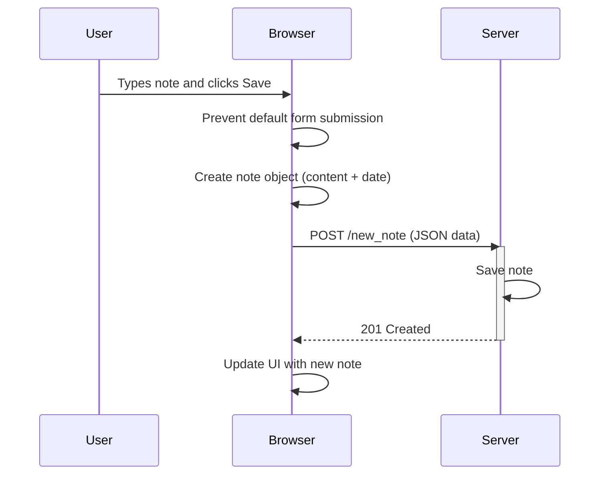

```mermaid
sequenceDiagram
    participant User
    participant Browser
    participant Server

    User->>Browser: Types note and clicks Save
    Browser->>Browser: Prevent default form submission
    Browser->>Browser: Create note object (content + date)
    Browser->>Server: POST /new_note (JSON data)
    activate Server
    Server->>Server: Save note
    Server-->>Browser: 201 Created
    deactivate Server
    Browser->>Browser: Update UI with new note
```
